<div align="center">
  
</div>
<div align="center">
  
</div>

[Wexford Treasures](https://wexford-treasures-afe33013c7ab.herokuapp.com/) is a captivating portfolio project tailored for discerning individuals seeking exquisite hampers. Representing a comprehensive e-commerce platform, it seamlessly integrates Stripe payment processing for effortless transactions. With meticulous attention to detail, the project showcases a harmoniously themed website, meticulously designed to captivate users and exemplify the breadth of skills honed throughout its development journey

## Table of Contents
1. <details open>
    <summary><a href="#ux">UX</a></summary>

    <ul>
    <li><details>
    <summary><a href="#goals">Goals</a></summary>

    - [Visitor Goals](#visitor-goals)
    - [Business Goals](#business-goals)
    - [User Stories](#user-stories)
    </details></li>

    <li><details>
    <summary><a href="#visual-design">Visual Design</a></summary>

    - [Wireframes](#wireframes)
    - [Fonts](#fonts)
    - [Icons](#icons)
    - [Colors](#colors)
    - [Images](#images)
    </details></li>
    </ul>
</details>

2. <details open>
    <summary><a href="#features">Features</a></summary>

    <ul>
    <li><details>
    <summary><a href="#page-elements">Page Elements</a></summary>

    - [All Pages](#all-pages)
    - [Home Page](#home-page)
    - [Product Page](#product-page)
    - [Hampers Page](#hampers-page)
    - [Gifts Page](#gifts-page)
    - [Special Offers Page](#special-offers-page)
    </details></li>

    <li><details>
    <summary><a href="#additional-features">Additional Features</a></summary>

    - [Image Loading Blur](#image-loading-blur)
    - [Email](#email)
    </details></li>

    <li><details>
    <summary><a href="#feature-ideas">Feature Ideas</a></summary>

    - [Basic](#basic)
    - [Content](#content)
    </details></li>
    </ul>
</details>

3. <details open>
    <summary><a href="#technologies-used">Technologies Used</a></summary>

    - [Languages](#languages)
    - [Frameworks](#frameworks)
    - [Libraries](#libraries)
    - [APIs](#apis)
    - [Platforms](#platforms)
    - [Other Tools](#other-tools)
</details>

4. <details open>
    <summary><a href="#testing">Testing</a></summary>

    <ul>
    <li><details>
    <summary><a href="#methods">Methods</a></summary>

    - [Validation](#validation)
    - [General Testing](#general-testing)
    - [Mobile Testing](#mobile-testing)
    - [Desktop Testing](#desktop-testing)
    </details></li>

    <li><details>
    <summary><a href="#bugs">Bugs</a></summary>

    - [Known Bugs](#known-bugs)
    - [Fixed Bugs](#fixed-bugs)
    </details></li>
    </ul>
</details>

5. <details open>
    <summary><a href="#deployment">Deployment</a></summary>

    <ul>
    <li><details>
    <summary><a href="#local-deployment">Local Deployment</a></summary>

    - [Local Preparation](#local-preparation)
    - [Local Instructions](#local-instructions)
    </details></li>

    <li><details>
    <summary><a href="#github-deployment">Github Deployment</a></summary>

    - [Github Preparation](#github-preparation)
    - [Github Instructions](#github-instructions)
    </details></li>
    </ul>
</details>

6. <details open>
    <summary><a href="#credit-and-contact">Credit and Contact</a></summary>

    - [Content](#content)
    - [Contact](#contact)
</details>

----

# UX
## Goals
### Visitor Goals
- The target audience for Wexfordd Treasures are:
- Individuals seeking premium and unique gift options for special occasions.
- Customers looking for visually stunning and curated hampers to impress recipients.
- Gourmet enthusiasts exploring a diverse selection of high-quality food and beverage hampers.
- Gift givers seeking convenient online shopping with secure payment options.
- Visitors interested in discovering the story and craftsmanship behind each curated hamper collection.

User goals are:
- Browse a gallery of beautifully curated hampers for various occasions.
- Discover unique and themed hampers to suit different tastes and preferences.
- Easily contact the seller or customer support for inquiries or assistance with purchases.
- Access detailed product descriptions and specifications to make informed buying decisions.
- Follow the journey and inspiration behind each hamper collection, including the stories and craftsmanship involved.

Wexford Treasures fills these needs by:
- Featuring captivating visuals of our hampers, enticing exploration.
- Showcasing an extensive gallery of hampers on the product page.
- Offering seamless communication with a prominent "Email" link in the footer.
- Integrating social media for updates and behind-the-scenes content.
- Providing a seamless review submission process, allowing customers to share their thoughts and recommendations with others.


### Business Goals
The Business Goals of Wexford Treasures are:
- Showcase and emphasize the uniqueness of our curated hampers.
- Grow the subscriber base through an engaging newsletter.
- Facilitate seamless communication channels for customer inquiries and support.
- Enhance brand visibility and engagement through active social media presence.
- Provide accessible pathways for customers to purchase our hampers.

### User Stories
User Stories for Wexford Treasures:
- As a gift shopper, I anticipate discovering a diverse range of beautifully curated hampers for various occasions.
- I expect the hampers to be prominently featured, allowing me to easily explore different collections and themes.
- As a gourmet enthusiast, I look forward to exploring hampers inspired by different cuisines and premium ingredients.
- As someone seeking gift inspiration, I expect to find informative details about each hamper's contents and presentation.
- As a customer interested in purchasing a hamper, I expect to find a convenient way to contact customer support for inquiries or assistance.
- I anticipate learning about the stories behind each curated hamper collection, providing insight into the craftsmanship and inspiration behind the creations.
- As someone who enjoys staying updated, I look forward to following Wexford Treasures on social media for the latest product launches, promotions, and behind-the-scenes glimpses.
- I expect to receive timely updates and exclusive offers from Wexford Treasures through their social media channels.
- If I decide to make a purchase, I expect to easily find information on how to place an order and complete the transaction.

## Visual Design
### Wireframes
Wireframes: (https://github.com/phillywhitty/wexford_treasures/tree/main/Wireframes)

### Fonts
<div align="center">
  
</div>

- The primary font Raleway was choosen because it is a sleek and elegant sans-serif font renowned for its modern appeal, readability, and versatility, making it an ideal choice for conveying sophistication and style across various design projects

### Icons
<div align="center">
  
</div>

Icons sourced from the Font Awesome Icon library are implemented as classes within the <i> tag.
- Because these icons are utilized as classes, they can be effortlessly styled using other classes or IDs within the same tag. 
- Bootstrap classes are frequently employed to ensure uniform styling. 
 

### Colors
<div align="center">
  
</div>

- The color palette of medium slate blue, moonstone, black, and white was chosen for the hamper website to evoke a sense of elegance, sophistication, and modernity. Medium slate blue adds a calming and trustworthy element, while moonstone lends a touch of softness and warmth. The use of black and white provides a classic and timeless backdrop, allowing the products to stand out while ensuring readability and clarity in design elements. Together, these colors create a harmonious and visually appealing aesthetic that resonates with the brand's upscale image and enhances the user experience


### Images
<div align="center">
  
</div>

- The website prominently features high-resolution images of hampers to showcase their quality and presentation, enticing visitors with visual appeal.
- Utilizing a script during image loading ensures seamless user experience by initially displaying blurred thumbnails that transition into sharp, full-quality images once fully loaded, enhancing the website's performance.
- Hampers are elegantly presented in a responsive grid layout, ensuring optimal viewing experience across various devices and screen sizes.
- Visitors can view hampers in detail by clicking on small images, triggering a full-page modal that provides an immersive viewing experience.
- The website dynamically adjusts image spacing within columns, ensuring a balanced and visually pleasing product view layout, contributing to an engaging user experience that encourages exploration.

----

# Features
## Page Elements
### All Pages
#### Navbar
<div align="center">
  
  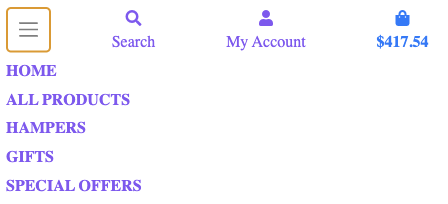
</div>

- The Navbar is simple, providing only four options containing All Products, Hampers, Gifts and Special Offers to maintain the minimalist style.
- The Logo and Heading remains to the left, they are removed to suit smaller devices to leave more space for my dropdown nav.
- On smaller devices, the menu becomes collapsible.
- The mobile nav button has been placed to the left for ease of use with one hand.
- Logged-in users see their account logo and shopping cart balance to the right for quick access to personal and shopping information


#### Toasts
<div align="center">
  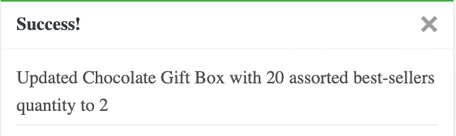
</div>

- Bootstrap toasts were incorporated to deliver customers with notifications regarding their interactions on the website.

#### Footer
<div align="center">
  
  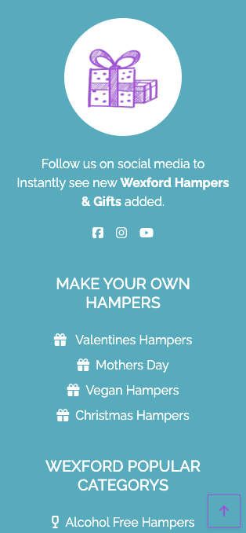
</div>

- Located at the bottom of every page, it includes a hamper logo, social media links, three headings containing Make your own hampers with useful links, then the most popular category heading contains links to Wexford Treasures best, and finally it contains Contact Info as the last heading.
- The headings all stack for responsiveness.
- Social media logos brings users to Wexford Treasure on social media for the latest product launches, promotions, and behind-the-scenes glimpses


### Home Page

<div align="center">
  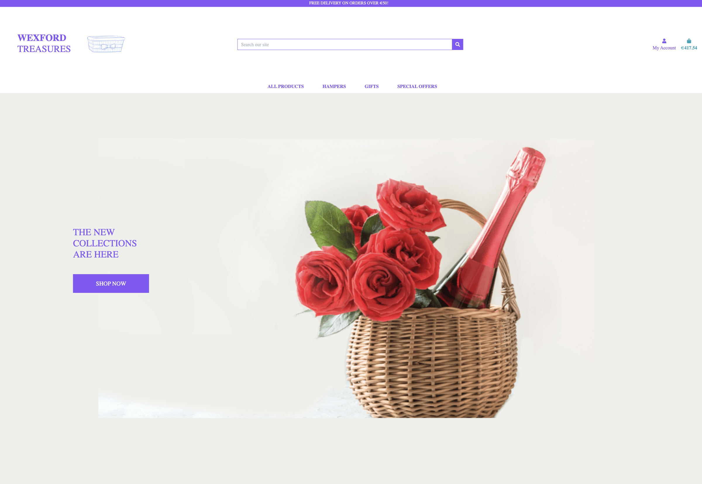
</div>

- This is the home page, where every detail is crafted with my experience in mind. 
- As soon as you land on the  website, you're greeted with a captivating background image carefully selected to engage users senses and set the tone for their journey. 
- The streamlined navbar ensures effortless navigation, allowing users to explore hampers with ease.
-  At the heart of the page, the prominent heading stands proudly next to the wexford treasure hamper logo, inviting users to discover the essence of the brand. 
- For users ready to embark on their shopping adventure, a centrally located "Shop Now" button beckons, ready to whisk them away to explore the exquisite range of products.


### Sign Up Page
<div align="center">
  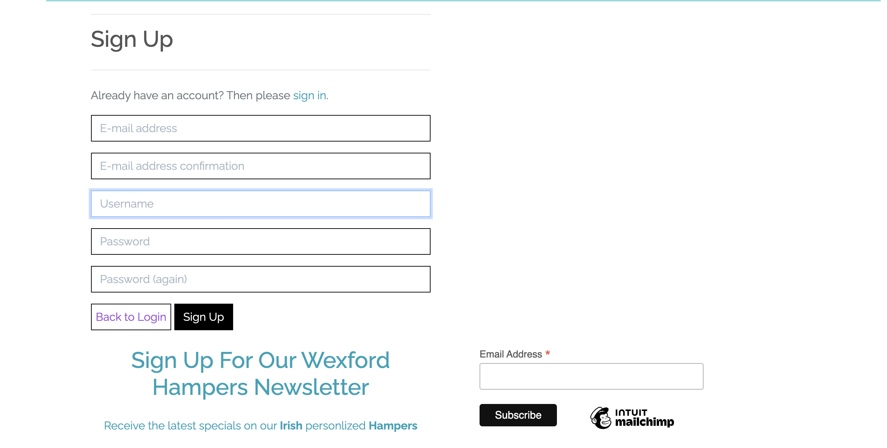
</div>

### Sign In Page
<div align="center">
  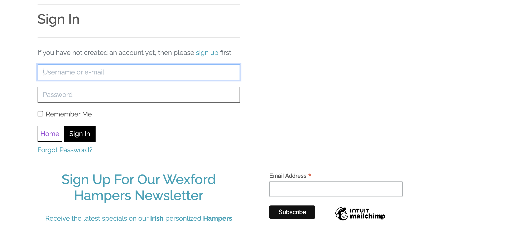
</div>


#### Product Page
#### Hampers Page
#### Gifts Page
#### Special Offers Page
<div align="center">
  
</div>

- The product, hamper, gift, and special offer pages on our website boast a cohesive and user-friendly design.
- Each page showcases our diverse range of offerings in a consistent layout featuring four columns, ensuring an organized and visually appealing display.
- Designed to be responsive, the layout seamlessly adjusts to suit all devices, from desktops to mobile phones, providing an optimal viewing experience for every user.

### Product Detail Page
<div align="center">
  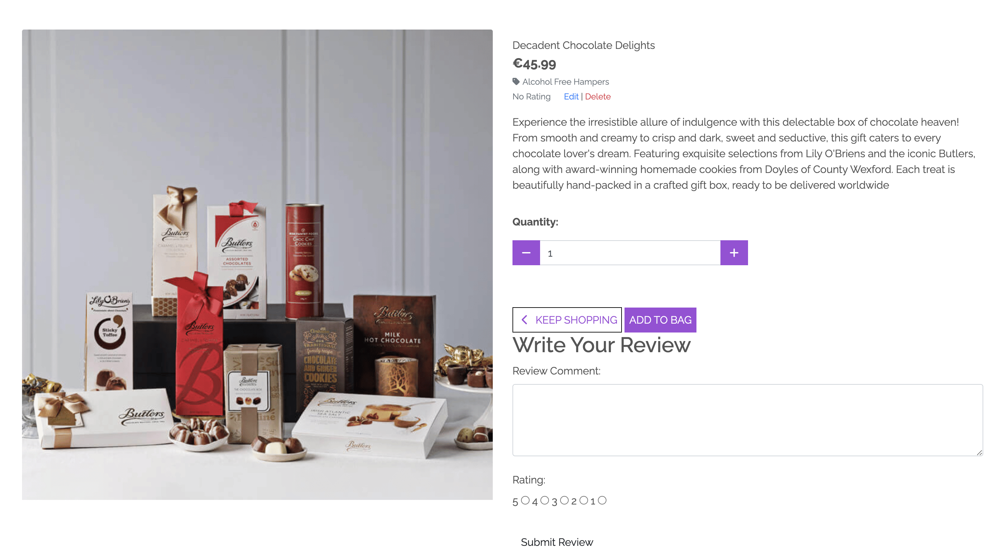
</div>

### Review
<div align="center">
  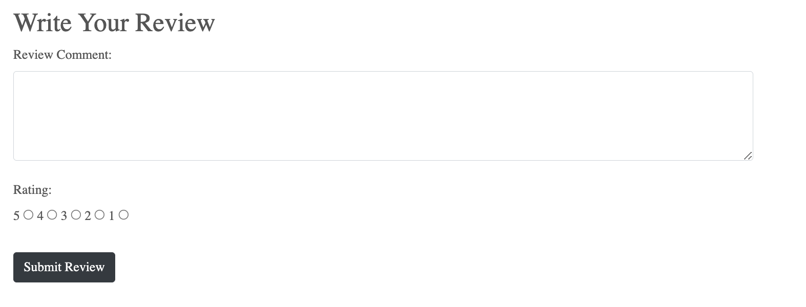
</div>

- Authenticated users can utilize the reviews section to submit feedback for a product.


### Product Management Page
<div align="center">
  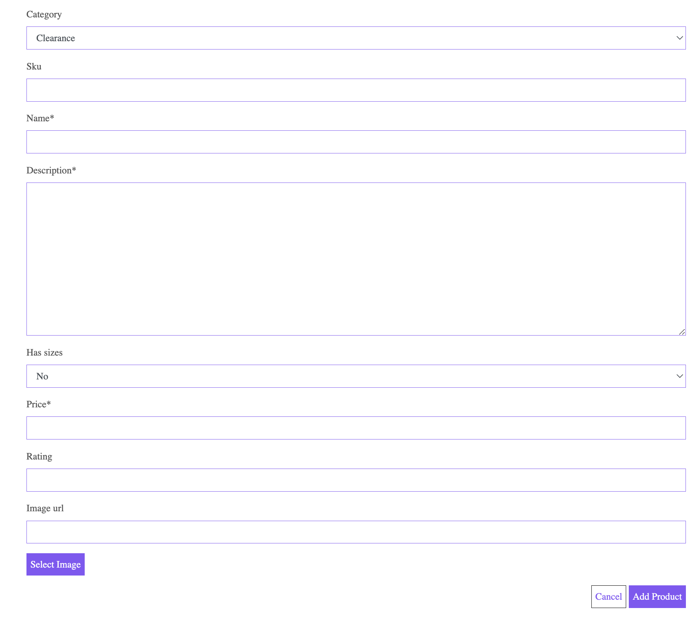
</div>

### Shopping Bag Page
<div align="center">
  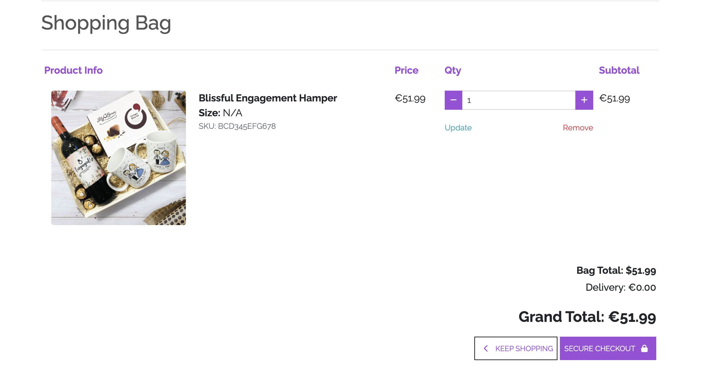
</div>

### Checkout Page
<div align="center">
  
</div>

### Checkout Success
<div align="center">
  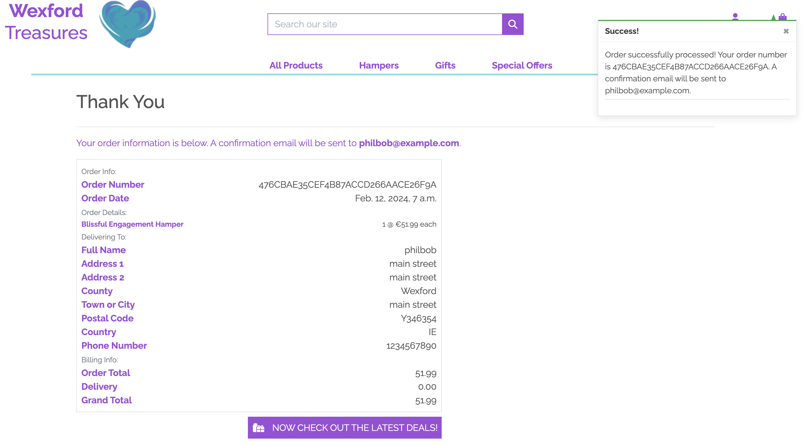
</div>

---

## Models

User information is stored within a relational database. The primary framework has been meticulously crafted to accommodate a variety of functionalities including product management, order placement, feedback submission, saving card details, and the ability to showcase hamper items :

- UserLogInEntry: Each row represents an entry recording the login activity of users on the website.
- Permission: Each row denotes a specific permission granted to users, dictating their access level within the system.
- Product Category: Each row categorizes products, providing organization and navigation for users browsing the shop.
- Product Wishlist: Each row represents a product that a user has added to their wishlist for future consideration or purchase.- User Wallet: Each row stores information about the wallet or virtual currency balance associated with a user's account.
- Product Review: Each row captures a user's review or feedback on a purchased product, aiding other users in their decision-making process.
- Email Address: Each row stores the email addresses associated with user accounts for communication and identification purposes.Place Order: Each row signifies an order that has been initiated by a user, awaiting confirmation and fulfillment.
- Checkout: Each row records the successful completion of an order transaction, indicating that payment has been processed and products are ready for shipment.

<div align="center">
  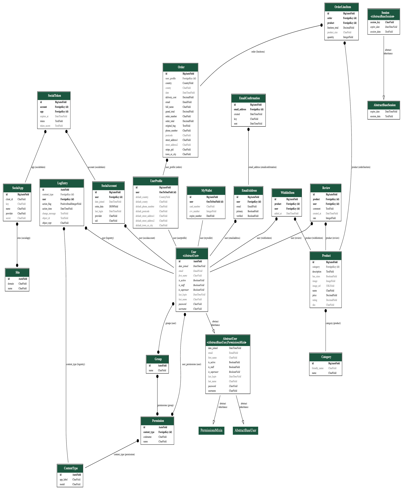
</div>


---

## Additional Features


### Email
- Mailchimp is functional on every page through the newsletter form.


## Future Ideas
### Basic
- Another section above the newsletter such as testimonials.
- An upgrade on the database, some styling added


### Content 
- A wider range of products and images.
- Blog posts on the website for making your own hampers.

----

# Technologies Used
## Languages
- HTML
- CSS
- JavaScript
- jQuery
- Bootstrap
- Python
- Django

## Frameworks
- [Bootstrap4](https://getbootstrap.com/)
    * Used for basic styles and outline.

## Libraries
- [JQuery](https://jquery.com/)
    * Animations and click functions.
- [Google Fonts](https://fonts.google.com)
    * Font Styles.
- [Fontawesome](https://fontawesome.com/)
    * Used for icons


## Platforms
- [Github](https://github.com/)
    * Storing code remotely and deployment.
- [Gitpod](https://gitpod.io/)
    * IDE for project development.

## Other Tools
- [Balsamiq](https://balsamiq.com/)
    * To create wireframes.
- [Favicon Generator](https://www.favicon-generator.org/)
    * Favicons
- [Canva](https://www.canva.com/)
    * Platform for images.
- [Coolors](https://coolors.co/)
    * Creating color pallettes.

----

## Testing
Testing documentation can be found [here.](TESTING.md)


## Search Engine Optimization SEO and Marketing

### SEO
- Descriptive meta tags were added to the main template, including title, description and keywords.
- A sitemap was generated using [xml-sitemaps](https://www.xml-sitemaps.com/) This was generated using the deployed website. The file is included in the root level of the project.
- Robots.txt file was created at the root level of the project. This file tells the search engine crawlers which URLs they can access on the website.


### Marketing
- Newsletter is included in all pages. This section enhances user interaction and boosts the e-commerce store's visibility through impactful email marketing strategies and a strong social media presence.

- Facebook Page
<div align="center">
  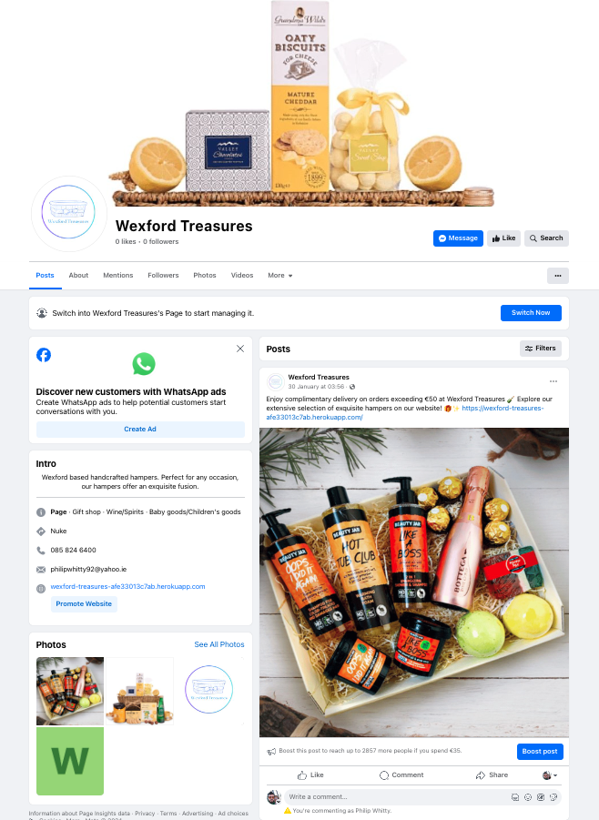
</div>


## Bugs
### Known Bugs
- Occasionally on a device with low RAM, the Google Maps API won't load.
- Devices with low RAM may have stuttered animations.
- Offline, using the backup map, the images don't switch the first time the page loads. No errors are shown on the console. A refresh usually solves the issue.
- Very slow connections may have users see the thumbnails pop in during iframe loading, rather than having the switch occur during the animation.

### Fixed Bugs
- Jumbotron image wouldn't de-blur. Fixed by adding a custom class for selection and differentiation.
- Markers wouldn't load if the connection to the API was slow. Fixed by adding a backup array to be used as a fall-back.
- EmailJS wasn't allowing newsletters to be sent on the contact page. Fixed by giving each form a separate ID.
- The map info window wouldn't dispose of itself but would open multiple instances, one over the other. Fixed by moving the initialisation instance outside of the click function.
- The info window would concatenate one country's information with another after clicked. Fixed by clearing the info window content on each click before populating it with info.
- If a country had multiple first languages, the info window would have a display that clipped them as they were stored in an array themselves. Fixed by writing a custom function to deal with languages.
- All map markers would bounce if they had animations set to active. Fixed by looping through the markers and setting them to no animation before activating the clicked marker's animation.
- The modal for images in the gallery wouldn't open because of the blur function. Fixed by changing the HTML structure on the page and the iframe.
- One I added SASS, many of the site's display features were broken. Fixed by cleaning up the CSS files and removing clashing styles.

----

# Deployment
## Local Deployment
### Local Preparation
**Requirements:**
- An IDE of your choice, such as [Visual Studio Code](https://code.visualstudio.com/)
- [Git](https://git-scm.com/)
- You will have to set up a connection with an email server through EmailJS:
- You will have to install SASS to compile the CSS. This depends on your system and your method choice. Please see the instructions [here](https://sass-lang.com/install).

### Local Instructions
1.  You can clone the repository with:
    ```
    git clone https://github.com/phillywhitty/wexford_treasures.git
    ```
    To disconnect it from the master repository, use:
    ```
    git remote rm origin
    ```
2. Open your IDE and choose the base directory.
3. Here you can install SASS with npm, if you choose, with:
    ```
    npm install -g sass
    ```
4. Run the compiler with:
    ```
    sass --watch assets/css/bootstrap_sass:assets/css
    ```
    This will also watch the bootstrap_sass folder for changes and re-compile the CSS when they are made. This way you can make changes quickly and not worry about re-compiling.
6. Switch the user token for EmailJS with your own. It can be found in the head tag:
    ```
    (function () {
        emailjs.init("<your user token>");
    })();
    ```
5. Run the project with your chosen method. You can drop index.html into a web browser and it should run fine, open a local port and access it or, if you have python installed, run it on an HTTP server with python with a command such as:
    ```
    python3 -m http.server
    ```
6. Enjoy the site!

## Github Deployment
### Github Preparation
- It is possible to copy or clone the repository to directly for deployment, but you will have to compile the make sure the SCSS compiles correctly first. Github Pages' Jekyll themes support this but you will have to make some customisations. Details can be found [here](https://jekyllrb.com/docs/assets/).
**Requirements:**
- A free GitHub account.

### Github Instructions
1. Log in to your GitHub account.
navigate to [https://github.com/phillywhitty/wexford_treasures.git](https://github.com/phillywhitty/wexford_treasures.git).
1. You can set up your own repository and copy or clone it, or you fork the repository.
2. `git add`, `git commit` and `git push` to a GitHub repository, if necessary.
3. GitHub pages will update from the master branch by default.
4. Go to the **Settings** page of the repository.
5. Scroll down to the **Github Pages** section.
7. Select the Master Branch as the source and **Confirm** the selection.
8. Wait a minute or two and it should be live for viewing.

## Credits and Contact
### Content
Nearly all text content was generated by the AI, GPT-4. Especially for product names as I had some many. I also generated random skus using chat-gpt. It certainly helps and found it great
at explaining certain terms but it can be very undependable in certain circumstances and I always double checked any text I generated using it.
Most of my Images were screenshots of certain hampers across sites such as (https://hampersdirect.ie/) (https://hampershop.ie/) and then I also used Canva.
I used screenshots but then always made sure to change to title and description of products and made up random prices.
I felt I had to use hamper images off certain websites for a consistent look for my images as Canva didnt have enough category hamper images.

### Acknowledgements
- A huge shoutout to Rory Patrick Sheridan for being an amazing mentor throughout the course.
  He's fantastic at breaking down concepts, and I learned a ton from him, especially considering I came in without any IT background.
  Whenever I had questions, he was quick to respond, and he made our online sessions really enjoyable. His support really boosted my confidence.
  A pure gentleman !!
- I also want to give a big shoutout to Kera Cudmore on Slack. 
  Whenever I encountered issues, I reached out to her, and her guidance along with the resources she shared always proved incredibly helpful.
  Kera is actively engaged on Slack, offering assistance to numerous individuals. 
  Her dedication and wealth of knowledge are truly inspiring.
- I'd also like to extend my gratitude to everyone I interacted with at student support. 
  Their outstanding support greatly contributed to my learning journey and helped me immensely in navigating challenges.

### Contact
Please feel free to contact me at `philipwhitty92@yahoo.ie`