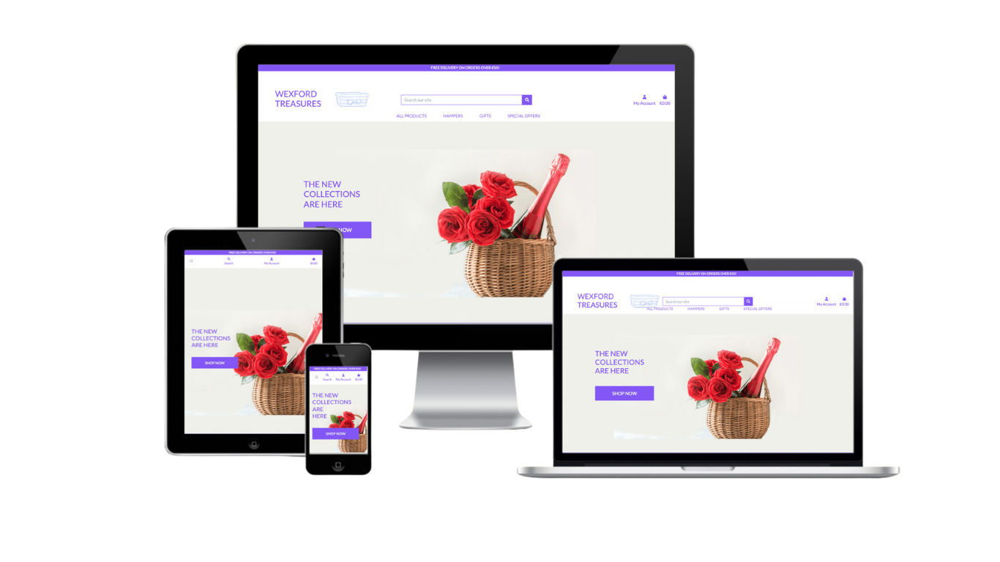
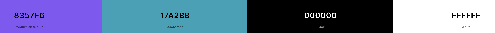
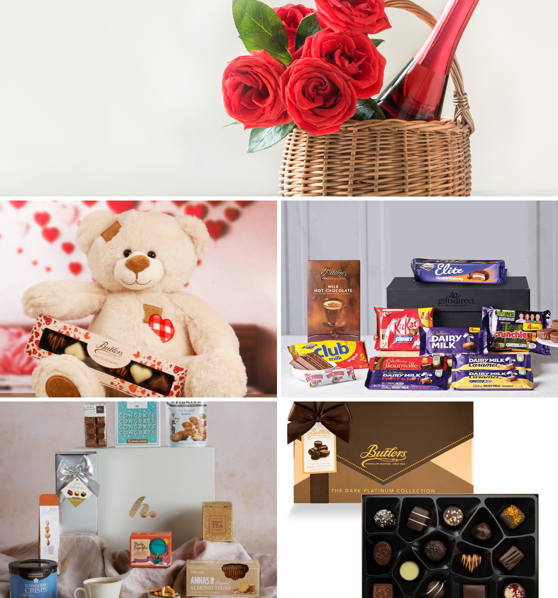

<div align="center">
  
</div>
<div align="center">
  
</div>

[Wexford Treasures](https://wexford-treasures-afe33013c7ab.herokuapp.com/) is a captivating portfolio project tailored for discerning individuals seeking exquisite hampers. Representing a comprehensive e-commerce platform, it seamlessly integrates Stripe payment processing for effortless transactions. With meticulous attention to detail, the project showcases a harmoniously themed website, meticulously designed to captivate users and exemplify the breadth of skills honed throughout its development journey

## Table of Contents
1. <details open>
    <summary><a href="#ux">UX</a></summary>

    <ul>
    <li><details>
    <summary><a href="#goals">Goals</a></summary>

    - [Visitor Goals](#visitor-goals)
    - [Business Goals](#business-goals)
    - [User Stories](#user-stories)
    </details></li>

    <li><details>
    <summary><a href="#visual-design">Visual Design</a></summary>

    - [Wireframes](#wireframes)
    - [Fonts](#fonts)
    - [Icons](#icons)
    - [Colors](#colors)
    - [Images](#images)
    - [Styling](#styling)
    </details></li>
    </ul>
</details>

2. <details open>
    <summary><a href="#features">Features</a></summary>

    <ul>
    <li><details>
    <summary><a href="#page-elements">Page Elements</a></summary>

    - [All Pages](#all-pages)
    - [Index Page](#index-page)
    - [Gallery Page](#gallery-page)
    - [Contact Page](#contact-page)
    </details></li>

    <li><details>
    <summary><a href="#additional-features">Additional Features</a></summary>

    - [Image Loading Blur](#image-loading-blur)
    - [Email](#email)
    </details></li>

    <li><details>
    <summary><a href="#feature-ideas">Feature Ideas</a></summary>

    - [Basic](#basic)
    - [Content](#content)
    </details></li>
    </ul>
</details>

3. <details open>
    <summary><a href="#technologies-used">Technologies Used</a></summary>

    - [Languages](#languages)
    - [Frameworks](#frameworks)
    - [Libraries](#libraries)
    - [APIs](#apis)
    - [Platforms](#platforms)
    - [Other Tools](#other-tools)
</details>

4. <details open>
    <summary><a href="#testing">Testing</a></summary>

    <ul>
    <li><details>
    <summary><a href="#methods">Methods</a></summary>

    - [Validation](#validation)
    - [General Testing](#general-testing)
    - [Mobile Testing](#mobile-testing)
    - [Desktop Testing](#desktop-testing)
    </details></li>

    <li><details>
    <summary><a href="#bugs">Bugs</a></summary>

    - [Known Bugs](#known-bugs)
    - [Fixed Bugs](#fixed-bugs)
    </details></li>
    </ul>
</details>

5. <details open>
    <summary><a href="#deployment">Deployment</a></summary>

    <ul>
    <li><details>
    <summary><a href="#local-deployment">Local Deployment</a></summary>

    - [Local Preparation](#local-preparation)
    - [Local Instructions](#local-instructions)
    </details></li>

    <li><details>
    <summary><a href="#github-deployment">Github Deployment</a></summary>

    - [Github Preparation](#github-preparation)
    - [Github Instructions](#github-instructions)
    </details></li>
    </ul>
</details>

6. <details open>
    <summary><a href="#credit-and-contact">Credit and Contact</a></summary>

    - [Content](#content)
    - [Contact](#contact)
</details>

----

# UX
## Goals
### Visitor Goals
- The target audience for Wexfordd Treasures are:
- Individuals seeking premium and unique gift options for special occasions.
- Customers looking for visually stunning and curated hampers to impress recipients.
- Gourmet enthusiasts exploring a diverse selection of high-quality food and beverage hampers.
- Gift givers seeking convenient online shopping with secure payment options.
- Visitors interested in discovering the story and craftsmanship behind each curated hamper collection.

User goals are:
- Browse a gallery of beautifully curated hampers for various occasions.
- Discover unique and themed hampers to suit different tastes and preferences.
- Easily contact the seller or customer support for inquiries or assistance with purchases.
- Access detailed product descriptions and specifications to make informed buying decisions.
- Follow the journey and inspiration behind each hamper collection, including the stories and craftsmanship involved.

Wexford Treasures fills these needs by:
- Featuring captivating visuals of our hampers, enticing exploration.
- Showcasing an extensive gallery of hampers on the product page.
- Offering seamless communication with a prominent "Email" link in the footer.
- Integrating social media for updates and behind-the-scenes content.
- Providing a seamless review submission process, allowing customers to share their thoughts and recommendations with others.


### Business Goals
The Business Goals of Wexford Treasures are:
- Showcase and emphasize the uniqueness of our curated hampers.
- Grow the subscriber base through an engaging newsletter.
- Facilitate seamless communication channels for customer inquiries and support.
- Enhance brand visibility and engagement through active social media presence.
- Provide accessible pathways for customers to purchase our hampers.

### User Stories
User Stories for Wexford Treasures:
- As a gift shopper, I anticipate discovering a diverse range of beautifully curated hampers for various occasions.
- I expect the hampers to be prominently featured, allowing me to easily explore different collections and themes.
- As a gourmet enthusiast, I look forward to exploring hampers inspired by different cuisines and premium ingredients.
- As someone seeking gift inspiration, I expect to find informative details about each hamper's contents and presentation.
- As a customer interested in purchasing a hamper, I expect to find a convenient way to contact customer support for inquiries or assistance.
- I anticipate learning about the stories behind each curated hamper collection, providing insight into the craftsmanship and inspiration behind the creations.
- As someone who enjoys staying updated, I look forward to following Wexford Treasures on social media for the latest product launches, promotions, and behind-the-scenes glimpses.
- I expect to receive timely updates and exclusive offers from Wexford Treasures through their social media channels.
- If I decide to make a purchase, I expect to easily find information on how to place an order and complete the transaction.

## Visual Design
### Wireframes
Wireframes: ""

### Fonts
<div align="center">
  
</div>

- The primary font Raleway was choosen because it is a sleek and elegant sans-serif font renowned for its modern appeal, readability, and versatility, making it an ideal choice for conveying sophistication and style across various design projects

### Icons
<div align="center">
  
</div>

Icons sourced from the Font Awesome Icon library are implemented as classes within the <i> tag.
- Because these icons are utilized as classes, they can be effortlessly styled using other classes or IDs within the same tag. 
- Bootstrap classes are frequently employed to ensure uniform styling. 
 

### Colors
<div align="center">
  
</div>

- The color palette of medium slate blue, moonstone, black, and white was chosen for the hamper website to evoke a sense of elegance, sophistication, and modernity. Medium slate blue adds a calming and trustworthy element, while moonstone lends a touch of softness and warmth. The use of black and white provides a classic and timeless backdrop, allowing the products to stand out while ensuring readability and clarity in design elements. Together, these colors create a harmonious and visually appealing aesthetic that resonates with the brand's upscale image and enhances the user experience


### Images
<div align="center">
  
</div>

- The site has a heavy focus on image use, using full-size quality images for exhibition purposes.
- As such, the images use a script while loading that blurs thumbnails and swaps in the full quality image when fully loaded.
- In the main gallery, images are displayed in three columns responsively, so they can easily be seen on any size device.
- Clicking on a small image will open up a full-page modal that displays the image in detail.
- The images will automatically space themselves vertically within the column, so the gallery height is even.
- Images will swap out on selecting another country, resetting the loading blur feature and changing URLs.

### Styling
- For this project I have utilised Bootstrap 4.5 source files to override their class defaults to my liking, making customisation much easier. The entire site can be restyled with a single switch in the code.
- The primary and secondary colors have been applied to bootstrap classes for easy use across the site.
- Using the SASS, sharp-edged boxes have been applied by default, taking advantage of the features.
- Responsive text sizing has also been enabled using SASS.
- As the site has a beeline focus on use, links on each page are re-used to direct the user to either the Gallery or the Contact page no matter where they look.
- Animations are utilised for smoothness in certain transitions, such as when a new country is selected in the gallery or on the Travel Gallery link.

----

# Features
## Page Elements
### All Pages
#### Navbar
<div align="center">
  
  
</div>

- The Navbar is simple, providing only three options with only two very evident the Gallery and Contact pages, to maintain the minimalist style.
- The Logo is always highlighted, swapping position as necessary depending on device size.
- On smaller devices, the menu becomes collapsible.
- The mobile nav button has been placed to the right for ease of use with one hand.
- The navbar is fixed so it is visible no matter how far you scroll.

#### Footer
<div align="center">
  
  
</div>

- Located at the bottom of every page, mainly highlighting contact and social aspects with the photographer.
- Made of three columns, changing shape for larger or smaller devices.
- The first column has a newsletter signup box that uses EmailJS to make contact with the photographer.
- A modal confirming the message has been sent and changes on success or an error is used for a response.
- A message encouraging contact is used as the second column.
- The third column represents social media links, highlighting 500px as the place to purchase photos.

### Index Page
#### Jumbotron Image
- Used as a splash image that highlights a dramatic photograph, representing a sense of adventure.
- An image with a person in it is used so the viewer can connect with it on a personal level.
- Uses the javascript lazy loading feature as the image is large and must show all at once for an impact
- Text is blurred and comes into view with the image to draw attention to the phrase.

#### About Section
<div align="center">
  
</div>

- After the initial image to give a strong impact, the about section is presented in the contrasting accent color to make it stand out.
- Hopefully, the impact will create enough interest to read about the photographer.
- The section is responsive and the two columns will stack on resize.
- The section contains a fully responsive image and a small text section with responsively sized text.
- Contains a small link to a place where you can purchase or license photographs, highlighted and underlined in bold, this is in addition to the link in the footer.

#### Travel Gallery Link
- A full-width banner link that switches to brings the user to the gallery.
- Animated with CSS to draw attention on hover.
- Expands in size, seeming to exit from the page, and darkens the background to draw attention to the item.

### Gallery Page
<div align="center">
  
</div>

#### Interactive Map
<div align="center">
  
</div>

- Uses the[Google Maps Javascript API](https://developers.google.com/maps/documentation/javascript/tutorial) to load an interactive map.
- All features utilise javascript.
- The [Google Maps Styling Wizard](https://mapstyle.withgoogle.com/) has been used to keep the map consistent with the site pallette.
- The map zoom level is set differently depending on the device screen size.
- Map markers are automatically generated and pull info from the [REST Countries API](https://restcountries.eu/).
- Adding a country name to the `countryName` variable in `map.js` will allow a marker to be created with an info window that has the country statistics already filled.
- `map.js` will automatically format the country info for the info window to be easily readable.
- The info window has been styled to be consistent with the other elements of the site.
- Content in the info window will automatically delete and refresh for each marker.
- The country information is used to swap the picture URLs in the gallery.
- Markers are animated to drop onto the map together.
- The selected marker has been set to animate on click and stop any other animated markers. A second click will stop the animation.
- After being clicked the page will briefly show the info window opening before smoothly scrolling down to the gallery automatically to carry the user to the images.
- After a short scroll down a little arrow will appear in the bottom right which can be used to scroll to the top of the page again.
- If the [REST Countries API](https://restcountries.eu/) is unreachable for any reason, the `markerArray.js` file is used to produce the markers.
- In the backup function, the info window is not generated as that required the API.

#### Iframe Gallery
<div align="center">
  
</div>

- A fully responsive, javascript-backed iframe gallery.
- Displays three columns no matter the device size, so all photos are nicely displayed.
- Used as an iframe so the layout can be modified separately from the gallery data.
- Starts by displaying default images and an invitation to use the map.
- Once a map marker is clicked, the images will swap out URLs, and the countries images will show.
- Functions listen for a change to reset the image blur function.
- Information for a blurb is stored on the gallery page and injected into the loaded iframe on click.
- The swap is animated with jQuery to make it less sudden.
- Clicking on an image will insert the image source path into a modal before it pops up to display the image in full quality.
- The gallery's height can vary by photos and device, so there is a function to adjust the height.
- The function fires on page load one, and then each time a marker is clicked, after every image has loaded completely, otherwise the height set may be incorrect.
- The images in the gallery space vertically automatically based on the gallery height.

### Contact Page
<div align="center">
  
</div>

- A simple page highlighting the author with a contact form that utilises [EmailJS](https://www.emailjs.com/) to send the emails.
- The form has validation and is fully responsive.
- Once the send button is pressed, a modal will open notifying the user that the message is sending.
- The modal has fields that are modified by the `sendMail.js` script.
- A success or an error message will be displayed depending on the result.
- The form fields will be cleared only on a successful response.
- A response message is sent to every email received, set up in EmailJS as a template.

## Additional Features
### Image Loading Blur
- All images utilise a loading blur function to smooth out their loading as the high-quality images can slow things down.
- The function places a low-quality thumbnail as the default image, covering it with a CSS blur filter.
- Simultaneously, it loads the full quality image set as the background image. Once it detects it is loaded it adds a class.
- The class makes the thumbnail transparent, using animation to smooth the transition.
- Had to be carefully used to correctly open the image modal.

### Email
- EmailJS is functional on every page through the newsletter form.
- The newsletter form has all the same basic features, like the contact form; validation, the modal, success and error messages are all present.
- Differentiates between the contact page form for messages and the newsletter form.

## Feature Ideas
### Basic
- A selection of countries to click on that brings you directly to the gallery.
- The ability to share photos directly to social media.
- Purchasing on the site
- More details about countries.

### Content 
- A wider range of countries and images. At the moment I didn't want to clutter the map.
- The user selects a country and an API pull in relevant images of that location.
- An API wherein the placename and the blurb are automatically generated.
- Blog posts on the website for more flavour text.

----

# Technologies Used
## Languages
- [HTML](w3.org/standards/webdesign/htmlcss)
    * Page markup.
- [CSS](w3.org/standards/webdesign/htmlcss)
    * Styling.
- [SASS](https://sass-lang.com/)
    * Used to customise Bootstrap and CSS styles.
- [Javascript](https://developer.mozilla.org/en-US/docs/Web/JavaScript)
    * Running functions for interactive components, AJAX, etc.

## Frameworks
- [Bootstrap4](https://getbootstrap.com/)
    * Used for basic styles and outline.

## Libraries
- [JQuery](https://jquery.com/)
    * Animations and click functions.
- [Google Fonts](https://fonts.google.com)
    * Font Styles.
- [Fontawesome](https://fontawesome.com/)
    * Used for icons

## APIs
- [Google Maps Javascript API](https://developers.google.com/maps/documentation/javascript/tutorial)
    * Map, markers and styles.
- [REST Countries API](https://restcountries.eu/)
    * Statistics for infowindow, marker information

## Platforms
- [Github](https://github.com/)
    * Storing code remotely and deployment.
- [Gitpod](https://gitpod.io/)
    * IDE for project development.

## Other Tools
- [Balsamiq](https://balsamiq.com/)
    * To create wireframes.
- [Favicon Generator](https://www.favicon-generator.org/)
    * Favicons
- [Mockup Generator](https://techsini.com/multi-mockup/index.php)
    * For device mockup images.
- [Coolors](https://coolors.co/)
    * Creating color pallettes.

----

# Testing
## Methods
### Validation
- HTML has been validated with [W3C HTML5 Validator](https://validator.w3.org/).
- CSS has been validated with [W3C CSS Validator](https://jigsaw.w3.org/css-validator/) and auto-prefixed with [CSS Autoprefixer](https://autoprefixer.github.io/).
- Links checked with [W3C Link Checker](https://validator.w3.org/checklink).
- Each javascript file was tested on the site for errors and functionality using the console and with [JSHint](https://jshint.com/).

### General Testing
- Each feature was developed and tested in its own branch before being merged with master. Branches were subsequently deleted.
- Each time a feature was added, all the functions were tested to see if there was an impact.
- The site was sent to friends for feedback and testing.
- All forms have validation and will not submit without the proper information.
- .gitignore file has been included to prevent system file commits.
- The image loading blur has been thoroughly tested and gone through numerous iterations to optimise the smoothness of the transition on different devices and internet speeds.
- Backup Map functions have been tested in a local deployment.
- Email error functions have been tested offline as well.
- External links open in a new tab.

### Mobile Testing
- I tested the site personally on my Android device, going through the entire process, checking buttons, functions, checking out, etc. I was personally unable to test on iOS.
- The site was sent to friends and relatives for them to follow the same process. They have tested on their devices, including iOS.
- Chrome was utilised to inspect the site in mobile format, going through the pages and functions.

### Desktop Testing
- The site was developed on a Chromebook and, as such, the majority of testing occurred on Chrome.
- The site was tested by friends and relatives on numerous desktop devices.
- The site was marginally tested on other browsers, such as Firefox and Edge.
- Internet Explorer was not tested and the site was not developed with it in mind as support for the browser is gradually being dropped.

## Bugs
### Known Bugs
- Occasionally on a device with low RAM, the Google Maps API won't load.
- Devices with low RAM may have stuttered animations.
- Offline, using the backup map, the images don't switch the first time the page loads. No errors are shown on the console. A refresh usually solves the issue.
- Very slow connections may have users see the thumbnails pop in during iframe loading, rather than having the switch occur during the animation.

### Fixed Bugs
- Jumbotron image wouldn't de-blur. Fixed by adding a custom class for selection and differentiation.
- Markers wouldn't load if the connection to the API was slow. Fixed by adding a backup array to be used as a fall-back.
- EmailJS wasn't allowing newsletters to be sent on the contact page. Fixed by giving each form a separate ID.
- The map info window wouldn't dispose of itself but would open multiple instances, one over the other. Fixed by moving the initialisation instance outside of the click function.
- The info window would concatenate one country's information with another after clicked. Fixed by clearing the info window content on each click before populating it with info.
- If a country had multiple first languages, the info window would have a display that clipped them as they were stored in an array themselves. Fixed by writing a custom function to deal with languages.
- All map markers would bounce if they had animations set to active. Fixed by looping through the markers and setting them to no animation before activating the clicked marker's animation.
- The modal for images in the gallery wouldn't open because of the blur function. Fixed by changing the HTML structure on the page and the iframe.
- One I added SASS, many of the site's display features were broken. Fixed by cleaning up the CSS files and removing clashing styles.

----

# Deployment
## Local Deployment
### Local Preparation
**Requirements:**
- An IDE of your choice, such as [Visual Studio Code](https://code.visualstudio.com/)
- [Git](https://git-scm.com/)
- You will have to set up a connection with an email server through EmailJS:
- You will have to install SASS to compile the CSS. This depends on your system and your method choice. Please see the instructions [here](https://sass-lang.com/install).

### Local Instructions
1. Download a copy of the project repository [here](https://github.com/Ri-Dearg/neverlost-thrift/archive/master.zip) and extract the zip file to your base folder. Or you can clone the repository with:
    ```
    git clone https://github.com/Ri-Dearg/neverlost-thrift
    ```
    To disconnect it from the master repository, use:
    ```
    git remote rm origin
    ```
2. Open your IDE and choose the base directory.
3. Here you can install SASS with npm, if you choose, with:
    ```
    npm install -g sass
    ```
4. Run the compiler with:
    ```
    sass --watch assets/css/bootstrap_sass:assets/css
    ```
    This will also watch the bootstrap_sass folder for changes and re-compile the CSS when they are made. This way you can make changes quickly and not worry about re-compiling.
6. Switch the user token for EmailJS with your own. It can be found in the head tag:
    ```
    (function () {
        emailjs.init("<your user token>");
    })();
    ```
5. Run the project with your chosen method. You can drop index.html into a web browser and it should run fine, open a local port and access it or, if you have python installed, run it on an HTTP server with python with a command such as:
    ```
    python3 -m http.server
    ```
6. Enjoy the site!

## Github Deployment
### Github Preparation
- It is possible to copy or clone the repository to directly for deployment, but you will have to compile the make sure the SCSS compiles correctly first. Github Pages' Jekyll themes support this but you will have to make some customisations. Details can be found [here](https://jekyllrb.com/docs/assets/).
**Requirements:**
- A free GitHub account.
- A free EmailJS account.

### Github Instructions
1. Log in to your GitHub account.
navigate to [https://github.com/Ri-Dearg/neverlost-thrift](https://github.com/Ri-Dearg/neverlost-thrift).
1. You can set up your own repository and copy or clone it, or you fork the repository.
2. `git add`, `git commit` and `git push` to a GitHub repository, if necessary.
3. GitHub pages will update from the master branch by default.
4. Go to the **Settings** page of the repository.
5. Scroll down to the **Github Pages** section.
7. Select the Master Branch as the source and **Confirm** the selection.
8. Wait a minute or two and it should be live for viewing. See my own [here](https://ri-dearg.github.io/horizon-photo/).

## Credits and Contact
### Content
Nearly all text content was generated by the AI, GPT-2, at [Talk to Transformer](https://talktotransformer.com/).
**(So there will be plenty of grammar or spelling errors or even a bit of nonsense, but I thought it would be a fun addition to the project)88 
Any code utilised from a site is documented and credited within the code.
All photographs, authors, license rights, copyright, etc. used in this project can be found [here](https://unsplash.com/collections/8825126/used-in-horizon-photo). No credit is required from Unsplash,  
All other media used is my own.

### Contact
Please feel free to contact me at `sheridan.rp@gmail.com`