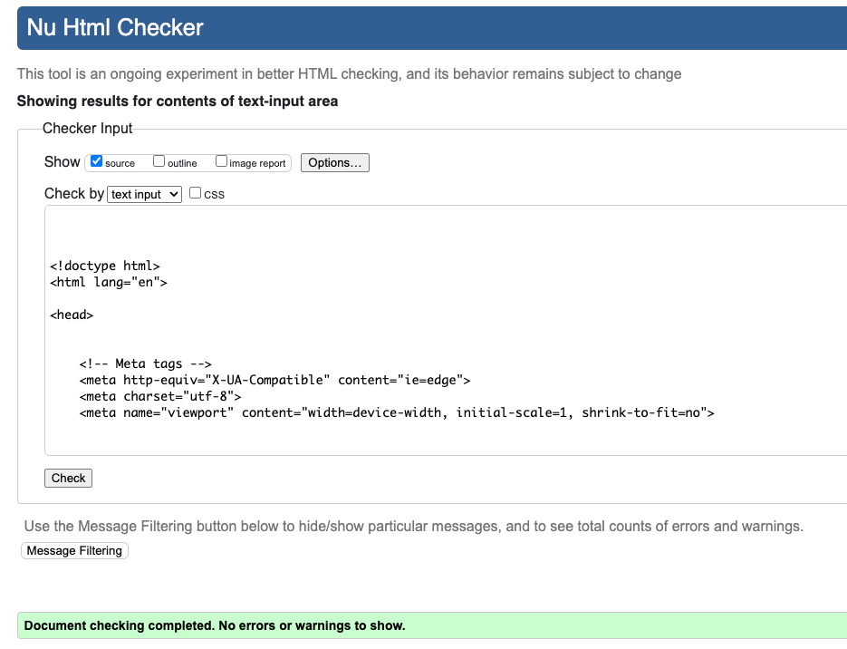
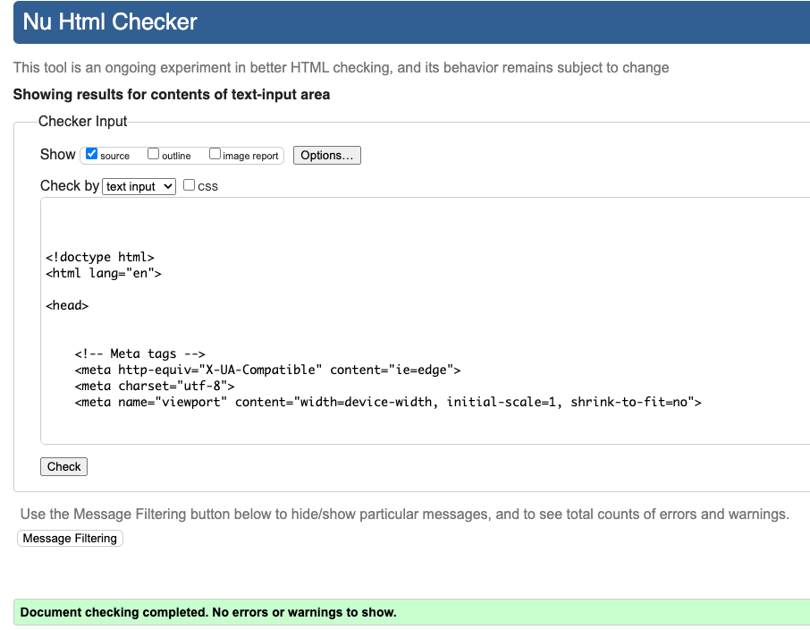
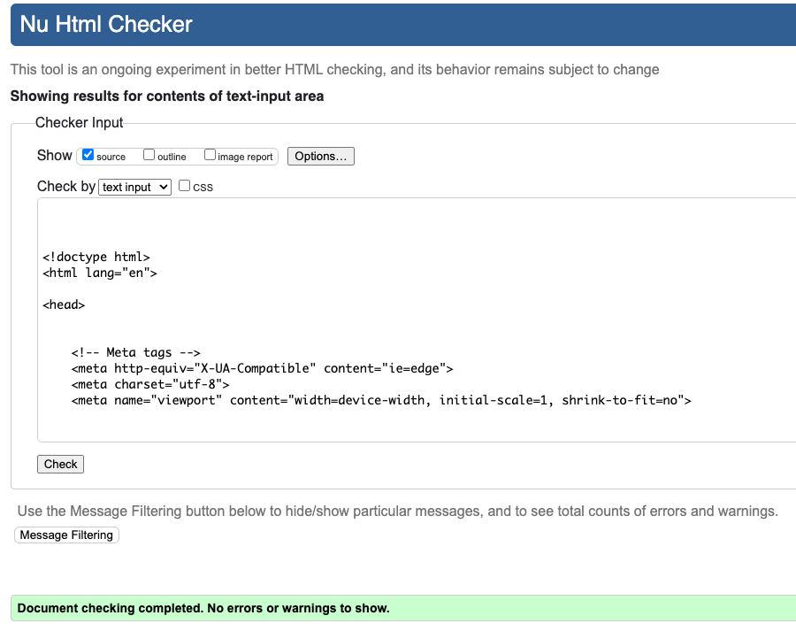

Go back to [README.md](/README.md)

# Testing
- [Code Validation](#code-validation)
    - [HTML](#html)
    - [CSS](#css)
    - [JavaScript](#JavaScript)
    - [Python](#python)
- [Responsiveness](#Responsiveness)
- [Browser Compatibility](#browser-compatibility)
- [Lighthouse](#Lighthouse)
- [Manual Testing](#manual-testing)
- [Automated Testing](#automated-testing)
- [User Story Testing](#user-story-testing)
- [Stripe](#stripe)

## Code Validation
### HTML
|Page|Validator|Result|
| --- | --- | --- |
| Index | | <mark>PASS<mark> |
| All products | | <mark>PASS<mark> |
| Products Detail| | <mark>PASS<mark> |
| Log In | | <mark>PASS<mark> |
| My Profile | | <mark>PASS<mark> |
| product | | <mark>PASS<mark> |
| author | | <mark>PASS<mark> |
| privacy policy | | <mark>PASS<mark> |
| edit review | | <mark>PASS<mark> |
| delete review | | <mark>PASS<mark> |
| my profile | | <mark>PASS<mark> |
| my orders | | <mark>PASS<mark> |
| my wishlist | | <mark>PASS<mark> |
| admin dashboard | | <mark>PASS<mark> |
| admin add product | | <mark>PASS<mark> |
| admin add author | | <mark>PASS<mark> |
| admin edit product | | <mark>PASS<mark> |
| admin delete product | | <mark>PASS<mark> |
| admin orders page | | <mark>PASS<mark> |
| admin order edit | | <mark>PASS<mark> |
| admin discount codes | | <mark>PASS<mark> |
| admin edit code | | <mark>PASS<mark> |
| admin delete code | | <mark>PASS<mark> |
| order success | | <mark>PASS<mark> |
| shopping cart | | <mark>PASS<mark> |
| shopping cart empty | | <mark>PASS<mark> |
| checkout | | <mark>PASS<mark> |
| login | | <mark>PASS<mark> |
| sign out | | <mark>PASS<mark> |
| sign up | | <mark>PASS<mark> |
| email confirmation | | <mark>PASS<mark> |
| email confirmation 2| | <mark>PASS<mark> |
| password reset 1 | | <mark>PASS<mark> |
| password reset 2 | | <mark>PASS<mark> |
| password reset 3 | | <mark>PASS<mark> |
| password reset 4 | | <mark>PASS<mark> |