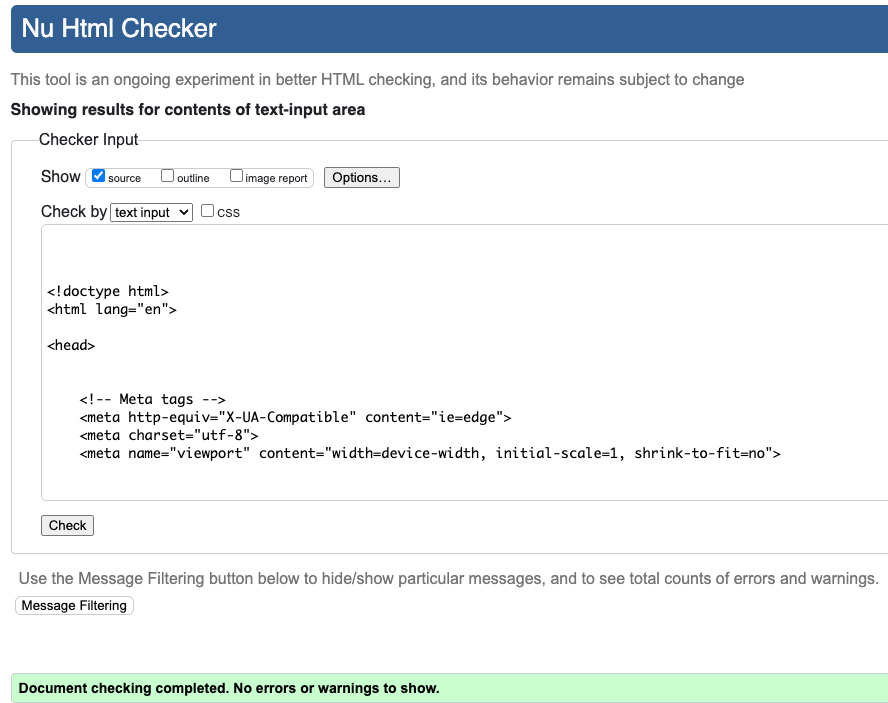

Go back to [README.md](/README.md)

# Testing
- [Code Validation](#code-validation)
    - [HTML](#html)
    - [CSS](#css)
    - [JavaScript](#JavaScript)
    - [Python](#python)
- [Responsiveness](#Responsiveness)
- [Browser Compatibility](#browser-compatibility)
- [Lighthouse](#Lighthouse)
- [Manual Testing](#manual-testing)
- [Automated Testing](#automated-testing)
- [User Story Testing](#user-story-testing)
- [Stripe](#stripe)

## Code Validation
### HTML
|Page|Validator|Result|
| --- | --- | --- |
| Index | | <mark>PASS<mark> |
| All products | | <mark>PASS<mark> |
| Products Detail| | <mark>PASS<mark> |
| Sign Up | | <mark>PASS<mark> |
| Log In | | <mark>PASS<mark> |
| My Profile | | <mark>PASS<mark> |
| My Wallet | | <mark>PASS<mark> |
| Checkout | | <mark>PASS<mark> |
| Checkout Success | | <mark>PASS<mark> |
| Log Out | | <mark>PASS<mark> |
| Reset Password| | <mark>PASS<mark> |
| Shopping Bag Empty | | <mark>PASS<mark> |

### CSS
|file|Validator|Result|
| --- | --- | --- |
| base.css | | <mark>PASS<mark> |
| checkout.css | | <mark>PASS<mark> |

## JavaScript
|file|Validator|Result|Comment|
| --- | --- | --- |----|
| index page | | <mark>PASS<mark> |This is mailchimp js script. It has 2 warnings and 3 undefined variables|
| products.js | | <mark>PASS<mark> ||
| profile.js | | <mark>PASS<mark> |This is js script from CI's walkthrough. I did not want to change this as the function is working. It has two warnings and shows $ as undefined variable |
| stripe.js | | <mark>PASS<mark> |This is stripe.js. I did also not want to change this as the function works perfect. It has two warnings and two undefined variables inlcuding $ & stripe |

## Python

|File|App|Image|Result|Comment|
| --- |----| --- | --- |----|
| urls | wexford_treasures | | <mark>PASS<mark> ||
| admin | profiles | | <mark>PASS<mark> ||
| apps | profiles | | <mark>PASS<mark> ||
| forms | profiles | | <mark>PASS<mark> ||
| models | profiles | | <mark>PASS<mark> ||
| urls | profiles | | <mark>PASS<mark> ||
| views | profiles | | <mark>PASS<mark> ||
| admin | products | | <mark>PASS<mark> ||
| apps | products | | <mark>PASS<mark> ||
| forms | products | | <mark>PASS<mark> ||
| models | products | | <mark>PASS<mark> ||
| urls | products | | <mark>PASS<mark> ||
| views | products | | <mark>PASS<mark> ||
| widgets | products | | <mark>PASS<mark> ||
| apps | home | | <mark>PASS<mark> ||
| urls | home | | <mark>PASS<mark> ||
| views | home | | <mark>PASS<mark> ||
| test | home | | <mark>PASS<mark> ||
| urls | home | | <mark>PASS<mark> ||
| views | home | | <mark>PASS<mark> ||
| admin | checkout || <mark>PASS<mark> ||
| apps | checkout || <mark>PASS<mark> ||
| forms | checkout || <mark>PASS<mark> ||
| models | checkout || <mark>PASS<mark> ||
| signals | checkout || <mark>PASS<mark> ||
| urls | checkout || <mark>PASS<mark> ||
| views | checkout || <mark>PASS<mark> ||
| webhook_handler | checkout || <mark>PASS<mark> ||
| webhooks | checkout || <mark>PASS<mark> | This was Stripes webhook and I didnt want to change anything|
| apps | bag || <mark>PASS<mark> ||
| context | bag || <mark>PASS<mark> ||
| urls | bag || <mark>PASS<mark> ||
| views | bag || <mark>PASS<mark> ||

## Browser Compatibility

|Browser|Result|Pass/Fail|Notes|
| --- | --- | --- | ---|
| Google Chrome | All pages, load as expected. All features work as expected | PASS | --- |
| Firefox | All pages, load as expected. All features work as expected | PASS | --- |
| Edge | All pages, load as expected. All features work as expected | PASS | ---|

## Lighthouse

|Page|Validator|Result|
| --- | --- | --- |
| Home Desktop | | <mark>PASS<mark> |
| Log-In Desktop | | <mark>PASS<mark> |
| Log-Out Desktop | | <mark>PASS<mark> |
| My Wallet Desktop | | <mark>PASS<mark> |
| Products Desktop | | <mark>PASS<mark> |
| Profile Desktop | | <mark>PASS<mark> |
| Shopping Bag Desktop | | <mark>PASS<mark> |

|User Story|Screenshot|Result|
| --- | --- | --- |
| As a shopper I can view a list of products so I can select some to purchase || <mark>PASS<mark> |
| As a shopper I will see display details for a specific product so that I can identify the price, description, product rating, product image and available sizes || <mark>PASS<mark> |
| As a shopper, I aim to swiftly spot discounts, clearance items, and special offers, enabling me to capitalize on exclusive savings for the products I intend to buy. || <mark>PASS<mark> |
| As a shopper, I can effortlessly check the overall cost of my purchases to assist in preventing excessive spending || <mark>PASS<mark> |
| As a site user, I can conveniently sign up for an account and possess a personal profile, enabling me to view my account details || <mark>PASS<mark> |
|As a site user, I can effortlessly log in or log out and gain access to my personal account information || <mark>PASS<mark> |
|As a site user, I can conveniently reset my password in case of forgetfulness, ensuring the recovery of access to my account || <mark>PASS<mark> |
| As a site user, I aim to possess a customized user profile for viewing my individual order history, order confirmations, and the option to save my payment information| <mark>PASS<mark> |
|As a site user, I aim to possess a customized user profile for viewing my individual order history, order confirmations, and the option to save my payment information || <mark>PASS<mark> |
|As a shopper, I would like the ability to arrange a list of products, making it effortless to pinpoint the top-rated, most reasonably priced, and categorically sorted items || <mark>PASS<mark> |
|As a shopper, I aim to have the capability to simultaneously sort multiple categories of products, facilitating the discovery of the best-priced or top-rated items across broad categories like hampers or gift sets || <mark>PASS<mark> |
|As a shopper, I desire the capability to search for a product by its name or description, allowing me to locate and purchase a specific item || <mark>PASS<mark> |
|As a shopper, I wish to quickly view my search results and the count, enabling me to promptly determine if the desired product is available || <mark>PASS<mark> |
|As a shopper, I desire the ability to inspect the items in my shopping bag before making a purchase, allowing me to identify the total cost of my order and review all the items I will receive. || <mark>PASS<mark> |
|As a shopper, I aim to effortlessly input my payment information, ensuring a quick and hassle-free checkout process || <mark>PASS<mark> |
|As a shopper, I aim to have the option to review an order confirmation after checkout, ensuring that I have not made any mistakes in my purchase || <mark>PASS<mark> |
|As a shopper, I desire to receive an email confirmation after completing the checkout process to retain a record of my purchase for my personal records || <mark>PASS<mark> |
|As a store owner, I wish to include a new product, allowing me to update my store with new items || <mark>PASS<mark> |

