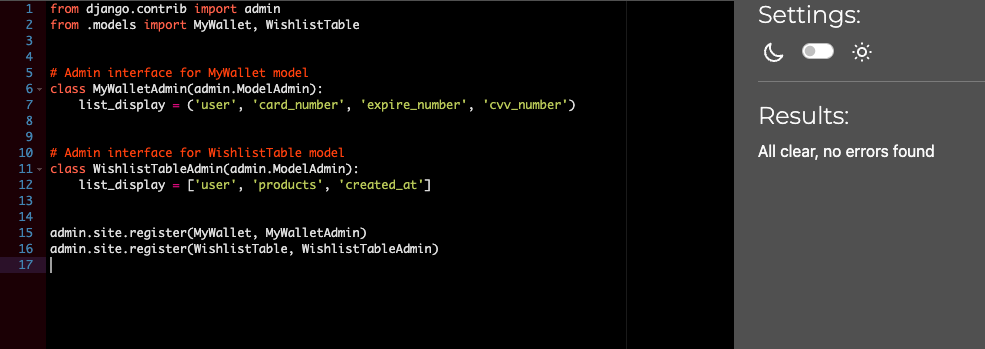
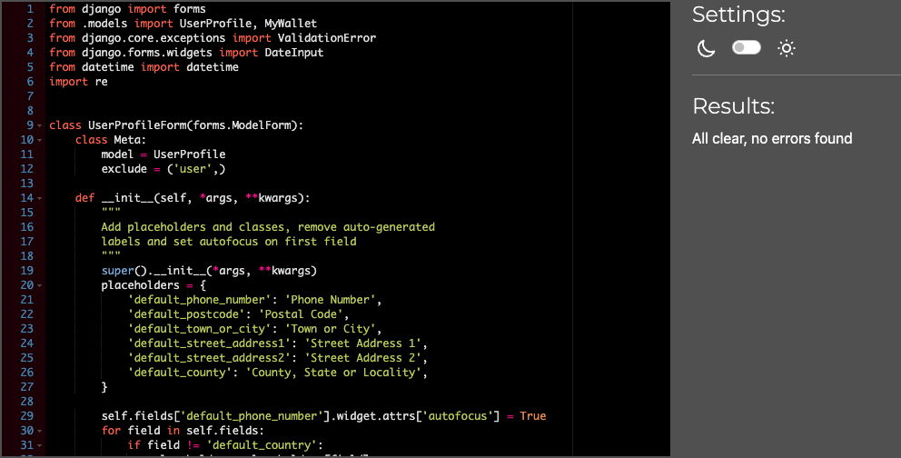

Go back to [README.md](/README.md)

# Testing
- [Code Validation](#code-validation)
    - [HTML](#html)
    - [CSS](#css)
    - [JavaScript](#JavaScript)
    - [Python](#python)
- [Responsiveness](#Responsiveness)
- [Browser Compatibility](#browser-compatibility)
- [Lighthouse](#Lighthouse)
- [Manual Testing](#manual-testing)
- [Automated Testing](#automated-testing)
- [User Story Testing](#user-story-testing)
- [Stripe](#stripe)

## Code Validation
### HTML
|Page|Validator|Result|
| --- | --- | --- |
| Index | | <mark>PASS<mark> |
| All products | | <mark>PASS<mark> |
| Products Detail| | <mark>PASS<mark> |
| Sign Up | | <mark>PASS<mark> |
| Log In | | <mark>PASS<mark> |
| My Profile | | <mark>PASS<mark> |
| My Wallet | | <mark>PASS<mark> |
| Checkout | | <mark>PASS<mark> |
| Checkout Success | | <mark>PASS<mark> |
| Log Out | | <mark>PASS<mark> |
| Reset Password| | <mark>PASS<mark> |
| Shopping Bag Empty | | <mark>PASS<mark> |

### CSS
|file|Validator|Result|
| --- | --- | --- |
| base.css | | <mark>PASS<mark> |
| checkout.css | | <mark>PASS<mark> |

## JavaScript
|file|Validator|Result|Comment|
| --- | --- | --- |----|
| index page | | <mark>PASS<mark> |This is mailchimp js script. It has 2 warnings and 3 undefined variables|
| products.js | | <mark>PASS<mark> ||
| profile.js | | <mark>PASS<mark> |This is js script from CI's walkthrough. I did not want to change this as the function is working. It has two warnings and shows $ as undefined variable |
| stripe.js | | <mark>PASS<mark> |This is stripe.js. I did also not want to change this as the function works perfect. It has two warnings and two undefined variables inlcuding $ & stripe |

## Python

|File|App|Image|Result|Comment|
| --- |----| --- | --- |----|
| urls | wexford_treasures | | <mark>PASS<mark> ||
| admin | profiles | | <mark>PASS<mark> ||
| apps | profiles | | <mark>PASS<mark> ||
| forms | profiles | | <mark>PASS<mark> ||
| models | profiles | | <mark>PASS<mark> ||
| urls | profiles | | <mark>PASS<mark> ||
| views | profiles | | <mark>PASS<mark> ||
| admin | products | | <mark>PASS<mark> ||
| apps | products | | <mark>PASS<mark> ||
| forms | products | | <mark>PASS<mark> ||
| models | products | | <mark>PASS<mark> ||
| urls | products | | <mark>PASS<mark> ||
| views | products | | <mark>PASS<mark> ||
| widgets | products | | <mark>PASS<mark> ||
| apps | home | | <mark>PASS<mark> ||
| urls | home | | <mark>PASS<mark> ||
| views | home | | <mark>PASS<mark> ||
| test | home | | <mark>PASS<mark> ||
| urls | home | | <mark>PASS<mark> ||
| views | home | | <mark>PASS<mark> ||
| admin | checkout || <mark>PASS<mark> ||
| apps | checkout || <mark>PASS<mark> ||
| forms | checkout || <mark>PASS<mark> ||
| models | checkout || <mark>PASS<mark> ||
| signals | checkout || <mark>PASS<mark> ||
| urls | checkout || <mark>PASS<mark> ||
| views | checkout || <mark>PASS<mark> ||
| webhook_handler | checkout || <mark>PASS<mark> ||
| webhooks | checkout || <mark>PASS<mark> | This was Stripes webhook and I didnt want to change anything|
| apps | bag || <mark>PASS<mark> ||
| context | bag || <mark>PASS<mark> ||
| urls | bag || <mark>PASS<mark> ||
| views | bag || <mark>PASS<mark> ||

## Browser Compatibility

|Browser|Result|Pass/Fail|Notes|
| --- | --- | --- | ---|
| Google Chrome | All pages, load as expected. All features work as expected | PASS | --- |
| Firefox | All pages, load as expected. All features work as expected | PASS | --- |
| Edge | All pages, load as expected. All features work as expected | PASS | ---|

## Lighthouse

|Page|Validator|Result|
| --- | --- | --- |
| Home Desktop | | <mark>PASS<mark> |
| Log-In Desktop | | <mark>PASS<mark> |
| Log-Out Desktop | | <mark>PASS<mark> |
| My Wallet Desktop | | <mark>PASS<mark> |
| Products Desktop | | <mark>PASS<mark> |
| Profile Desktop | | <mark>PASS<mark> |
| Shopping Bag Desktop | | <mark>PASS<mark> |

|User Story|Screenshot|Result|
| --- | --- | --- |
| As a shopper I can view a list of products so I can select some to purchase || <mark>PASS<mark> |
| As a shopper I will see display details for a specific product so that I can identify the price, description, product rating, product image and available sizes || <mark>PASS<mark> |
| As a shopper, I aim to swiftly spot discounts, clearance items, and special offers, enabling me to capitalize on exclusive savings for the products I intend to buy. || <mark>PASS<mark> |
| As a shopper, I can effortlessly check the overall cost of my purchases to assist in preventing excessive spending || <mark>PASS<mark> |
| As a site user, I can conveniently sign up for an account and possess a personal profile, enabling me to view my account details || <mark>PASS<mark> |
|As a site user, I can effortlessly log in or log out and gain access to my personal account information || <mark>PASS<mark> |
|As a site user, I can conveniently reset my password in case of forgetfulness, ensuring the recovery of access to my account || <mark>PASS<mark> |
| As a site user, I aim to possess a customized user profile for viewing my individual order history, order confirmations, and the option to save my payment information| <mark>PASS<mark> |
|As a an authenticated user I want to be able to add a review for a book product so that I can share my feedback and experiences with other potential buyers || <mark>PASS<mark> |
|As a user I want to be able to register an account so that I can have access to all functionality of BookHeaven. || <mark>PASS<mark> |
|As a user, I want to be able to log in to my account so that I can access my personalized features and make purchases on BookHeaven. || <mark>PASS<mark> |
|As a registered user I want to be able to reset my password so that I can regain access to my account in case I forget my password || <mark>PASS<mark> |
|As a registered user I want to be able to see my profile page so that I can update my information || <mark>PASS<mark> |
|As a authenticated user, I want to be able to save books to my wishlist so that I can revisit and consider purchasing them later on BookHeaven. || <mark>PASS<mark> |
|As a user, I want to be able to add products to my shopping cart so that I can conveniently review and purchase multiple items at once on BookHeaven. || <mark>PASS<mark> |
|As a user, I want to be able to remove products from my shopping cart so that I can adjust my order before making a purchase on BookHeaven. || <mark>PASS<mark> |
|As a user, I want to be able to adjust the quantity of products in my shopping cart so that I can control the quantity of items I want to purchase on BookHeaven. || <mark>PASS<mark> |
|As a user, I want to be able to apply discount codes to my orders so that I can enjoy savings and discounts on my purchases at BookHeaven. || <mark>PASS<mark> |
|As a user, I want to be able to securely make payments using Stripe so that I can complete my purchases on BookHeaven with confidence. || <mark>PASS<mark> |
|As an administrator, I want to have access to an admin dashboard so that I can monitor and view simple statistics related to the orders made on BookHeaven. || <mark>PASS<mark> |
|As an administrator, I want to be able to add new products to the website so that I can expand the product catalog on BookHeaven. || <mark>PASS<mark> |
|As an administrator, I want to be able to remove products from the website so that I can manage the product catalog on BookHeaven. || <mark>PASS<mark> |
|As an administrator, I want to be able to edit existing products on the website so that I can update and manage the product catalog on BookHeaven. || <mark>PASS<mark> |
|As an administrator, I want to be able to edit the stock levels of products so that I can manage inventory and ensure product availability on BookHeaven. || <mark>PASS<mark> |
|As a user, I want to be able to submit a testimonial about my overall experience with the website so that I can provide feedback and share my positive experiences on BookHeaven. || Won't Have |
|As a user, I want to be able to view testimonials submitted by other users so that I can read about the experiences and feedback of fellow users on BookHeaven. || Won't Have |
|As a website owner, I want to improve the website's search engine optimization (SEO) so that the website can rank higher in search engine results and attract more organic traffic.  |Descriptive meta tags were added to the main template, including title, description and keywords. A sitemap was generated using xml-sitemaps This was generated using the deployed website. The file is included in the root level of the project. Robots.txt file was created at the root level of the project. This file tells the search engine crawlers which URLs they can access on the website.| <mark>PASS<mark> |
|As a user, I want to sign up for newsletters on the website so that I can keep up with updates and deals. || <mark>PASS<mark> |
|As a user I want to be able to sort the list of available products by name and price so that I can easily find books that match my interests || <mark>PASS<mark> |
|As a User I want to be able to complete the checkout process for my shopping cart so that I can purchase the items I've added to my cart || <mark>PASS<mark> |
|As a an authenticated user I want to be able to delete my reviews for a book product so that I can manage and maintain the accuracy and relevance of my feedback || <mark>PASS<mark> |
|As a an authenticated user I want to be able to edit my reviews for a book product so that I can manage and maintain the accuracy and relevance of my feedback || <mark>PASS<mark> |