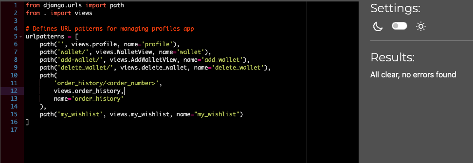

Go back to [README.md](/README.md)

# Testing
- [Code Validation](#code-validation)
    - [HTML](#html)
    - [CSS](#css)
    - [JavaScript](#JavaScript)
    - [Python](#python)
- [Responsiveness](#Responsiveness)
- [Browser Compatibility](#browser-compatibility)
- [Lighthouse](#Lighthouse)
- [Manual Testing](#manual-testing)
- [Automated Testing](#automated-testing)
- [User Story Testing](#user-story-testing)
- [Stripe](#stripe)

## Code Validation
### HTML
|Page|Validator|Result|
| --- | --- | --- |
| Index | | <mark>PASS<mark> |
| All products | | <mark>PASS<mark> |
| Products Detail| | <mark>PASS<mark> |
| Sign Up | | <mark>PASS<mark> |
| Log In | | <mark>PASS<mark> |
| My Profile | | <mark>PASS<mark> |
| My Wallet | | <mark>PASS<mark> |
| Checkout | | <mark>PASS<mark> |
| Checkout Success | | <mark>PASS<mark> |
| Log Out | | <mark>PASS<mark> |
| Reset Password| | <mark>PASS<mark> |
| Shopping Bag Empty | | <mark>PASS<mark> |

### CSS
|file|Validator|Result|
| --- | --- | --- |
| base.css | | <mark>PASS<mark> |
| checkout.css | | <mark>PASS<mark> |

## JavaScript
|file|Validator|Result|Comment|
| --- | --- | --- |----|
| index page | | <mark>PASS<mark> |This is mailchimp js script. It has 2 warnings and 3 undefined variables|
| products.js | | <mark>PASS<mark> ||
| profile.js | | <mark>PASS<mark> |This is js script from CI's walkthrough. I did not want to change this as the function is working. It has two warnings and shows $ as undefined variable |
| stripe.js | | <mark>PASS<mark> |This is stripe.js. I did also not want to change this as the function works perfect. It has two warnings and two undefined variables inlcuding $ & stripe |

## Python

|File|App|Image|Result|Comment|
| --- |----| --- | --- |----|
| urls | wexford_treasures | | <mark>PASS<mark> ||
| admin | profiles | | <mark>PASS<mark> ||
| apps | profiles | | <mark>PASS<mark> ||
| forms | profiles | | <mark>PASS<mark> ||
| models | profiles | | <mark>PASS<mark> ||
| urls | profiles | | <mark>PASS<mark> ||
| views | profiles | | <mark>PASS<mark> ||
| admin | products | | <mark>PASS<mark> ||
| apps | products | | <mark>PASS<mark> ||
| forms | products | | <mark>PASS<mark> ||
| models | products | | <mark>PASS<mark> ||
| urls | products | | <mark>PASS<mark> ||
| views | products | | <mark>PASS<mark> ||
| widgets | products | | <mark>PASS<mark> ||
| apps | home | | <mark>PASS<mark> ||
| urls | home | | <mark>PASS<mark> ||
| views | home | | <mark>PASS<mark> ||
| test | home | | <mark>PASS<mark> ||
| urls | home | | <mark>PASS<mark> ||
| views | home | | <mark>PASS<mark> ||
| admin | checkout || <mark>PASS<mark> ||
| apps | checkout || <mark>PASS<mark> ||
| forms | checkout || <mark>PASS<mark> ||
| models | checkout || <mark>PASS<mark> ||
| signals | checkout || <mark>PASS<mark> ||
| urls | checkout || <mark>PASS<mark> ||
| views | checkout || <mark>PASS<mark> ||
| webhook_handler | checkout || <mark>PASS<mark> ||
| webhooks | checkout || <mark>PASS<mark> | This was Stripes webhook and I didnt want to change anything|
| apps | bag || <mark>PASS<mark> ||
| context | bag || <mark>PASS<mark> ||
| urls | bag || <mark>PASS<mark> ||
| views | bag || <mark>PASS<mark> ||

